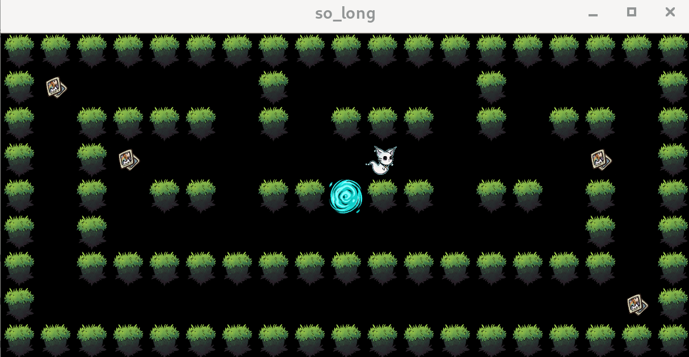

*This project has been created as part of the 42 curriculum by mherrera.*

## DESCRIPTION:

This project is a fundamental part of the second Milestone from the 42 School. During its execution, you will learn how to use the MLX42 or MiniLibX library. Both libraries were developed internally, and include basic necessary tools to open a window, create images, and deal with keyboard and mouse events. The project is also one of the first ones in which you will have to understand how to correctly parse and protect your code, as well as to manage dynamic memory.

## INSTRUCTIONS:

The project compiles using a MAKEFILE in which the necessary compilation rules for C programs are declared, as well as the corresponding flags.

So, in order to compile the project, you will only need to use the 'make' command.

To execute the program, you will have to use the following command:

`./so_long includes/maps/map_name.ber`

## RESOURCES:

Some tutorials were used as reference for a better understanding of the project. Some of them are listed below:

<https://42-cursus.gitbook.io/guide/2-rank-02/so_long>
<https://medium.com/@digitalpoolng/42-so-long-and-thanks-for-all-the-fish-building-your-first-2d-game-in-c-ccd24034bc8b>
<https://github.com/codam-coding-college/MLX42/blob/master/docs/index.md>

AI was only used for researching purposes, but it was avoided as much as possible.

Textures were created by me (mherrera).

